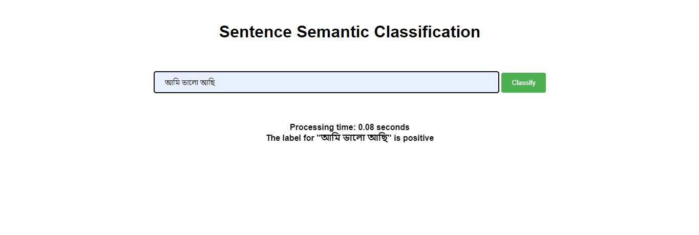

# Sentiment Analysis
This FastAPI application is designed for performing sentiment analysis on Bengali text.

## Installation 

To set up the application, follow these instructions:


```

git clone https://github.com/arnabsroy9/Sentiment-Analysis.git
cd Sentiment-Analysis
pip install -r requirements.txt

```

Download the model weight from [here](https://drive.google.com/drive/folders/1EuHZStggkSZIfltNuNvyttey6ZPrdvD9). 

Copy the pytorch_model.bin file and paste it into the Sentiment-Analysis/app/sentiment directory.

### You're ready to go...

## Inference 

To run the sentiment analysis application, open a terminal in the Sentiment-Analysis directory and execute the following command:
```
uvicorn main:app --reload
```
## Output preview


